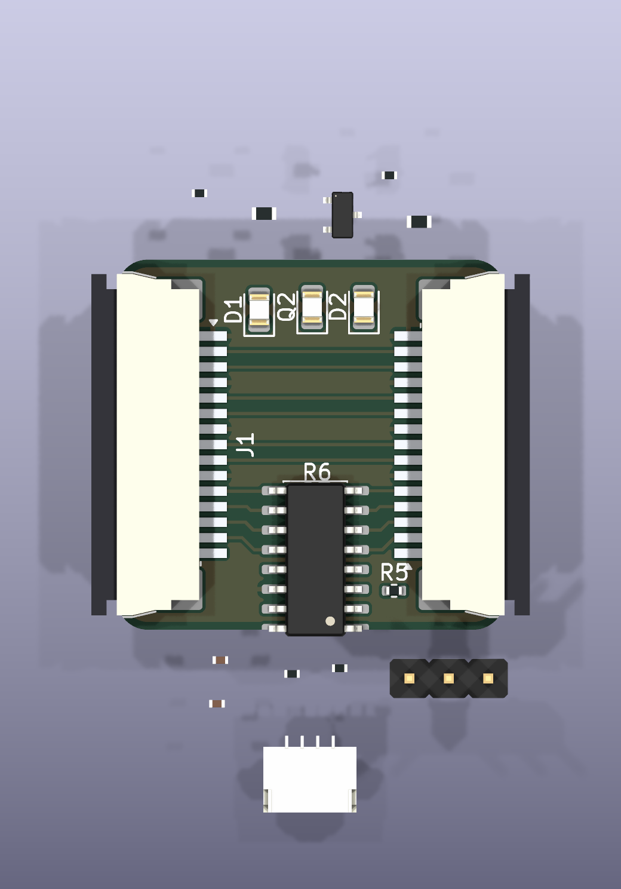
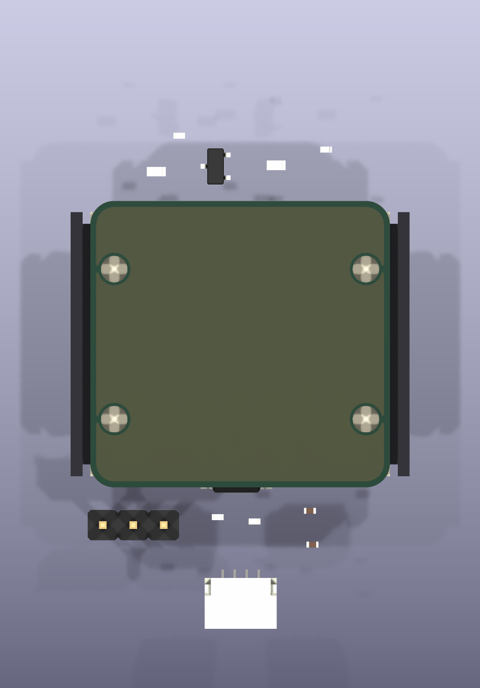
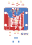
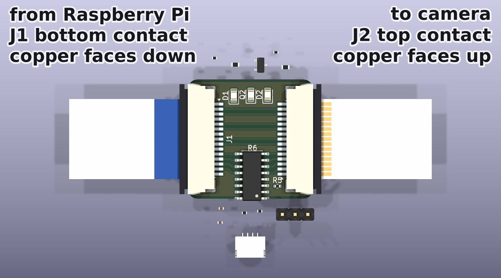
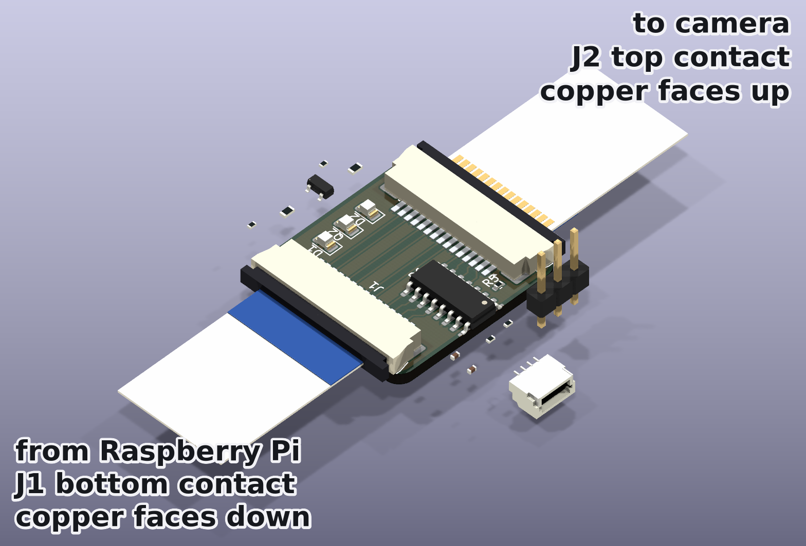

# RPi Camera LED

An interposer for the Raspberry Pi camera flex cable (15 pin, 1.0 mm pitch FPC).
It sits in the middle of the cable, passes all fifteen camera signals straight
through, and adds a CH32V003A4M6 that gives the Pi I2C-controlled camera GPIO,
PWM illumination LEDs and an ambient light reading.

## Hardware

[KiCad schematic](hardware/rpi-camera-led.kicad_sch) ·
[PDF](hardware/rpi-camera-led.pdf) ·
[board](hardware/rpi-camera-led.kicad_pcb)

### Board: 15-way FFC camera interposer

| 3D render, top | 3D render, bottom | Layout (copper, silk, outline) |
|:--------------:|:-----------------:|:------------------------------:|
|  |  |  |

25.0 × 23.9 mm, two layers, everything on the front. J1 (left) faces the
Raspberry Pi and J2 (right) faces the camera; they sit 180° apart so the two
cable segments leave opposite edges and the board drops into an existing cable
run in line. The MCU is the SOIC-16 in the middle, the two white illumination
LEDs and the phototransistor are along the top edge.

The outline is the Camera Module 2 board: 25.000 × 23.862 mm with 2.0 mm corner
radii, and the same four Ø2.2 mm mounting holes, so the interposer takes the
camera's screws. Those come straight off the official mechanical drawing
([RP-008149-DS](https://pip.raspberrypi.com/categories/1205-drawings-and-schematics),
RPI-CAM-V2_1): *"4x 2.2mm diameter holes"*, 2 mm in from each end of the 25 mm
axis — a 21.0 mm pitch — and 12.5 mm apart on the other. `check_pcb.py` now
verifies pitch and drill, because these went missing once already without
anyone noticing.

**The layout is in progress.** Eleven of the twenty footprints — C1, C2, J3,
J4, Q1, R1–R4, R8 and R9 — are still parked outside the board outline, which is
why they float around the board in the renders. The fifteen-way pass-through
bus is routed; the rest is not. DRC reports 21 violations and 34 unconnected
items.

Four of those violations are the mounting holes, and they are a real conflict
rather than noise. **All four holes land underneath a connector housing.** On
the camera the 21.0 mm pitch runs between two edges that carry nothing, and its
single FFC connector sits on a third; this board has a connector on *both* ends
of that axis, each housing 5.30 mm deep, so the holes — 2 mm in from each end —
sit under them. Nothing on the board is wrong in isolation; the camera's
mounting pattern and two edge-mounted connectors simply cannot both fit on a
25 mm span. Resolving it means giving something up: a longer board, connectors
on the 25 mm edges instead, or mounting holes that no longer match the camera.

### How the cables run

| With cables fitted | Isometric |
|:------------------:|:---------:|
|  |  |

Both cables enter from the **outside** edges and run away from the board in
opposite directions, so the interposer drops into an existing cable run in
line. That follows from where the cable entry is on this connector: the
manufacturer's Section A‑A shows the solder tail stepping down and out at one
end while the cable channel opens at the other, and the top view labels
*Terminal* at one end and *Latch* at the other with the 5.30 mm housing
between them. It is also the only way a slide lock can work — you pull the
slider, insert the cable and push it back, all at the same end. So the cable
entry is at the latch end, away from the pads, and with each connector's
housing flush against its board edge that entry points outward.

The two cable stubs are drawn different ways up, and that is the point. J1 is
bottom contact, so its cable presents bared copper *downwards* and shows you
the blue backing; J2 is top contact, so its cable is the other way up and
shows you the conductors. That flip is the whole reason for pairing an F part
with an E part, and it is what lets both segments be ordinary Raspberry Pi
camera cables — the same flip you can see in a real cable, blue stiffener on
one face at one end, bared conductors on the other face at the other.

The stubs are illustrative and are not part of the board: they exist only in a
throwaway copy that the render script builds and deletes. Their 16.00 × 0.30 mm
section is the drawing's recommended FFC dimension. The bared conductors and
the backing are drawn a little longer than the 4 mm insertion depth so that a
few millimetres of each stay visible outside the connector — otherwise the
orientation they exist to show would be buried inside it.

Regenerate the images with `uv run hardware/tools/render_board.py`, and the
connector models with `uv run hardware/tools/gen_connector_model.py`. The
render script refills the copper zones first, via the pcbnew Python module
inside the KiCad snap, because `kicad-cli` has no zone-fill command and a
stale pour renders as authoritatively as a fresh one — when this was first
wired up the stored B.Cu pour was less than half its true area, and refilling
it dropped DRC from 116 violations to 17.

### Connectors, and which cables fit

J1 and J2 are **not** the same part, and that is deliberate:

| | part | contacts | mates with |
|---|---|---|---|
| **J1** → Raspberry Pi | JUSHUO AFA07-S15**F**CA-00 (LCSC C262721) | **bottom** — cable copper faces the board | a standard Pi camera cable |
| **J2** → camera | JUSHUO AFA07-S15**E**CA-00 (LCSC C262742) | **top** — cable copper faces away | a standard Pi camera cable |

The reason is cable parity. A Raspberry Pi camera cable is an *opposite-side*
FFC — "type 2", contacts on one face at one end and the other face at the other
— because the Pi's CSI socket is top-contact and the camera module's is
bottom-contact. Cutting one continuous cable anywhere yields one same-side half
and one opposite-side half, so an interposer whose two connectors want the
copper on the *same* face forces one odd, hard-to-buy cable. One that wants it
on *opposite* faces absorbs the asymmetry, and both segments become ordinary
Raspberry Pi camera cables. Bottom-contact at J1 plus top-contact at J2 is that
pairing.

The two variants share one land pattern — verified against both JUSHUO drawings
— so nothing on the board moves between them. Since only the contact side
differs, and it is invisible on an assembled board, the distinction is called
out in each symbol's value, in the MPN, and as a `BOTTOM CONTACT` / `TOP
CONTACT` marker on the fab layer.

Both footprints and their 3D models live in this repository, in
`hardware/rpi-camera-led.pretty` and `hardware/rpi-camera-led.3dshapes`. KiCad's
stock footprint references a STEP file for the JUSHUO AFA07 series that does not
exist — not in the KiCad distribution and not in `kicad-packages3D` upstream,
which ships no JUSHUO models at all. Third-party libraries have one, but under
terms that forbid redistribution, so `hardware/tools/gen_connector_model.py`
builds it from the manufacturer's published drawing instead: a 22.00 × 6.95 ×
2.50 mm envelope matching the drawing's DIM D, the F.Fab outline and the side
view's height, with the housing and latch coloured as the drawing's notes
specify. Both STEP and WRL are generated, the latter in the 0.1-inch units
KiCad expects.

The pass-through bus is wired J1 pin *k* ↔ J2 pin *16−k*. That looks reversed
but is exactly right: the two connectors are 180° apart, so J1 pad *k*
physically faces J2 pad *16−k*, and joining the pads that face each other is
both the straight route and the electrically transparent one — the board
behaves as a splice in the middle of one continuous cable.
`check_pcb.py` measures that facing alignment as a number, because losing it to
a stray drag puts a dogleg in all fifteen nets and is invisible by eye.

### Verifying

```
uv run hardware/tools/check_schematic.py   # ERC + netlist vs design intent
uv run hardware/tools/check_pcb.py         # connector alignment + DRC parity
```

`check_schematic.py` currently **fails**: its expected-netlist table still
describes the older pin-for-pin bus, and four issues from the last eeschema
session are open — U1 pin 13 is unconnected, SWIO and CAM_IO1 have been merged
onto one net, I2C is landed on pins that cannot carry it on this package (the
CH32V003 SOP-16 reaches the peripheral only on pins 1 and 2, since both AFIO
remaps need PD0 or PC5 and the package bonds out neither), and four no-connect
flags dangle.

The schematic is maintained by hand in eeschema — connections between adjacent
parts are drawn as wires rather than left implicit in matching global labels.
`hardware/tools/gen_schematic.py` is the generator that bootstrapped it, but
**running it overwrites the schematic** and would discard that manual wiring.

## Firmware

[CH32V003 firmware](firmware/README.md): a fail-safe I2C bootloader plus an
application exposing camera GPIO control, RPi-side GPIO readback, GPIO
pass-through, LED brightness (hardware PWM) and an ambient light reading over
a Linux-friendly SMBus register map at address 0x42. Builds with
`riscv64-unknown-elf-gcc` and [ch32v003fun](https://github.com/cnlohr/ch32v003fun)
(`git submodule update --init`, then `make` in `firmware/bootloader` and
`firmware/app`).

The firmware still targets the older pin map and needs updating to match the
current schematic.

## Research

Part availability research comparing [JLCPCB's PCBA parts
library](https://jlcpcb.com/parts) and [NextPCB's Rev0
service](https://www.nextpcb.com/rev0-pcba) (which sources components from [HQ
Online](https://www.hqonline.com/)'s 600k+ in-stock inventory):

* [I2C controllable RGB LEDs](research/i2c-rgb-leds.md)
* [I2C GPIO expanders with LED driving capability](research/i2c-gpio-expanders.md)
* [Cheap (< $0.50) MCUs with I2C and no external parts required](research/cheap-mcus.md)
* [RPi camera compatible FPC connectors (1.0 mm pitch, 15 pin)](research/fpc-connectors.md)

## License

Apache 2.0 — see [LICENSE](LICENSE).
